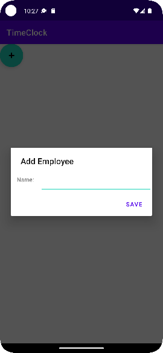
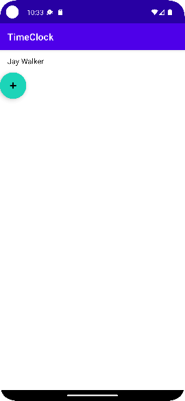
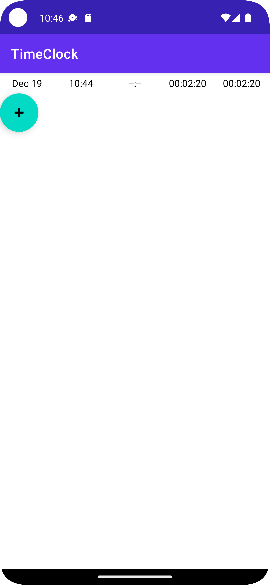
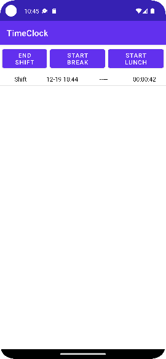

# Simple Time Clock

The Simple Time Clock application was originally created as an exercise in an interview process for
a job which offer failed to come through. But lest anything useful go to waste, I have decided to 
use it as a sample of my work. 

Through this example I hope to convey my approach to development: both by the excellence in design,
architecture, and code to which I aspire, and the methodical refinement of code and concept as
evidenced in the git commit logs. I am passionate about software quality from high level design
down through the nuts and bolts of implementation.

I believe this codebase reveals at least some of that passion.

Enjoy!

Greg (18 December 2022)

## Interview Candidate Requirements
This project was created to specifically fulfill the requirements specified by the Interview
Candidate Project instructions, which are reproduced below:

### Simple Time Clock Application
_Create an application that represents a simple time clock. You are free to use the programming
languange if your choice.  The application must follow the requirements listed below._

1. Allow user to be identified using a unique ID assigned to each employee.
    - Users that cannot be identified should not be able to use the application.
2. Allow users to start a work shift.
    - Do not allow users to start multiple shifts simultaneously.
3. Allow users to end a work shift.
    - Do not allow users to start a shift during an active shift.
4. Allow users to start/end a break, but only during an active shift. 
    - Do not allow employees to end a shift if a break is active.
5. Allow users to start/end a lunch, but only during an active shift.
    - Do not allow employees to end a shift if a lunch is active.
6. All shift data performed by users should be recorded and made available upon returning to the
7. application.
8. (Optional) Allow new users to register themselves in the application.
9. (Optional) Allow for two types of users in the application; administrators and non-
administrators.
10. (Optional) Allow administrators to perform any function at any time regardless of the rules
stated previously.
     - [GW] Need greater clarification on this rule. What is expected behavior in each case?
11. (Optional) Allow administrators to view a summary report section that summarizes all the
employee’s shift activity.
     - (Optional) Allow administrators to filter the report data.

## Analysis

Even without the optional requirements, this is a tall set of requirements to implement over a
relatively short time - 3 days, in this case. So rather than trying to do too much too quickly,
I designed and built a high quality, maintainable and extensible MVP focused only on the 
non-optional requirements.

### User Stories

#### As an Employee, I want to use the Simple Time Clock (STC) Application
- **Pre-Condition** I am not currently using STC 
- I launch the STC application
- I tell STC I am the active employee
- **Post-Condition** I am the active employee and can start a shift

#### As an Employee, I want to start a shift
- **Pre-Condition** I am the active employee 
- **Pre-Condition** I do not have an active shift
- I tell STC to I have started my shift
- **Post-Condition** My shift is started
    - STC starts accruing Shift Time

#### As an Employee, I want to take a break
- **Pre-Condition** I am on an active shift
- **Pre-Condition** I am not on break
- **Pre-Condition** I am not at lunch
- I tell STC I have started my break
- **Post-Condition** I am on break
    - STC stops accruing Shift Time
    - STC begins accruing Break Time  

#### As an Employee, I want to take lunch
- **Pre-Condition** I am on an active shift
- **Pre-Condition** I am not at lunch
- **Pre-Condition** I am not on break
- I tell STC I have started lunch
- **Post-Condition** I am at lunch
    - STC stops accruing Shift Time
    - STC begins accruing Lunch Time  

#### As an Employee, I want to end a break
- **Pre-Condition** I am on break
- I tell STC I am done with my break
- **Post-Condition** I am off break
    - STC resumes accruing Shift Time
    - STC stops accruing Break Time  

#### As an Employee, I want to end my lunch
- **Pre-Condition** I am at lunch
- I tell STC I am done with my lunch
- **Post-Condition** I am off lunch
    - STC resumes accruing Shift Time
    - STC stops accruing Lunch Time  

#### As an Employee, I want to end a shift
- **Pre-Condition** I am on an active shift
- **Pre-Condition** I am not on break
- **Pre-Condition** I am not at lunch
- I tell STC I am done with my shift
- **Post-Condition** My shift is stopped
    - STC stops accruing Shift Time

#### As an Employee, I want to review my WorkShifts
- **Pre-Condition** I am the active employee
- I ask STC to show me my workshifts, past and present
- STC shows me my shifts, past and present

## Design

We will start with a Model-View-ViewModel-Store architecture, which adds a layer for the traditional MVVM which abstracts the persistent
storage of Model data.

### Model (First Pass)
From the user stories, we see two main objects emerge, the Employee and the WorkShift. 

#### Employee
For our purposes, an Employee is rather a simple object; per the requirements, we only need to provide a unique id for the employee. 
From experience, we know that a human-readable name is an implied requirement of any entity in a system, users in particular. So we 
can define our Employee object as:
```
Employee {
    id: Guid
    name: String
}
```
with the appropriate accessor methods.

#### WorkShift
The WorkShift object is mostly a collection of time spans - shift start to finish, break start to finish, lunch start to finish.
And because there is a requirement for persistence, we will want a unique id for each shift, at the least. So our first pass might
look like this:
```
WorkShift {
    id: Guid
    shiftStart: DateTime
    shiftEnd: DateTime
    breakStart: DateTime
    breakEnd: DateTime
    lunchStart: DateTime
    lunchEnd: DateTime
}
```
again, with appropriate accessors.

### Model (Second Pass)

As we begin to implement this model, we find ourselves repeating code both across the Employee and
WorkShift class, and within the WorkShift class.

#### BaseModel
Since both `Employee` and `WorkShift` classes use a `Guid` as a unique id, the code that manages
this id can be extracted into a common base class, which for lack of a better term has been called
`BaseModel` here:
```
BaseModel {
    id: Guid
}
```
with only the id get accessor publicly available. There is only a protected constructor method, so
only derived classes can be instantiated. Both `Employee` and `WorkShift` will derive from 
`BaseModel`, and so inherit its common unique id management.

#### TimeSlice
Within the `WorkShift` class, we find ourselves writing duplicate code to managing the elapsed 
times of shifts, breaks, and lunches. This common functionality has been abstracted out into the
`TimeSlice` class:
```
TimeSlice: {
    start: DateTime
    end: DateTime
}
```
as well as accessor methods, including those that indicate the _state_ of the `TimeSlice` instance: 
- If `start` is `nil`, the slice is **inactive**.
- If `start` is not `nil` and `end` is `nil, the slice is **active**
- If `start` and `end` are both not `nil`, the slice is **complete**

We will use instances of this class to represent shift, break, and lunch times.

#### Employee
With the extraction of unique id handling to `BaseModel`, the `Employee` class is reduced to 
managing only the employee's name:
```
Employee : BaseModel {
    name: string
}
```

#### WorkShift
The WorkShift object is even more simplified, with `BaseModel` handling unique id management, and
`TimeSlice` handling the details of elapsed shift, break, and lunch times:
```
WorkShift : BaseModel {
    shift: TimeSlice
    break: TimeSlice
    lunch: TimeSlice
}
```
The `WorkShift` object does manage higher level calculations, like net shift time (which is total
shift time less break and lunch times).

### User Interface
The application **MUST** allow the user to select themselves as the current employee, and then
allow them to view existing WorkShifts and start new-ones, and then take a break and lunch during
the shift, all according to the rules above.

#### Authentication/User Selection
The first screen, therefore, is a user authentication screen. As there are no requirements for any 
sort of security, we will simply present a list of existing employees and allow the user to select
themselves from the list. 

If the employee does not exist, they can add themselves. When the application is run, if no there
are no employees stored, the user will be prompted to add one
:



Once we have at least one employee, the Select Employee screen is shown:



The user selects their employee record from the list and is shown their recorded shifts. If the 
user does not see themself in the list, they may add themselves via the Plus button, which brings
up the Add Employee screen, shown previously.

#### Employee History (WorkShift List) Screen
Shows a list of all shifts worked by the employee. 



For each shift, shows:
- start time of shift
- end time of shift (updated if still active)
- total elapsed time of shift
- net elapsed time of shift (total less break plus lunch)

#### Work Shift Detail Screen
Shows the details of a work shift:



- start and end time
- break start and end time (if any)
- lunch start and end time (if any)
- buttons allow start/end shift, break, lunch

## Running the Application
Unfortunately there is no easy way to run this application short of building it. To wit:
1. Download and install the [Android Developer Studio](https://developer.android.com/studio)
1. Get the code. Either:
    - Clone the repository: `git clone git@github.com:gregwinton/sample-time-clock.git`
    - Or, download and unzip [the archive](https://github.com/gregwinton/sample-time-clock/archive/refs/heads/main.zip).
1. Open the project in the afore-installed Android Developer Studio
1. Run the result on your device or, if you are truly brave (or desparate), in the emulator


## Next Steps
As it is, the result still could use a bit of polish:

- Add an application icon
- Set title with employee name on ListWorkShifts, ViewWorkShift screens
- Add real authentication
- Change user selection from current full page list of users to a more traditional login window (albeit without password)
- Add support for admin users 
    - limit access user list screen to admin users <- user's will only see their own shift activity
- Add filtering to employee work shift list
- Optimize use of MutableLiveData<> objects. 
    - not sure all are necessary.

## Known Issues
- Date display on WorkShift fragment - be smarter about date inclusion, don't need it for every date/time.
